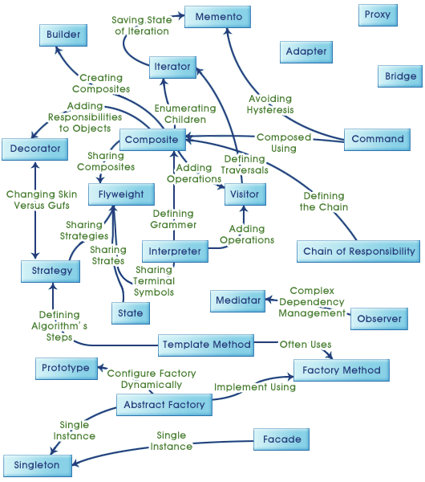

Workshop materials

## Design Pattern is,
- - -
### 디자인패턴? 그 전에 앞서, 잠깐 SOLID란? (디자인패턴은 SOLID원칙을 구체화하는 방법론? 아니면 결과물?)

##### SRP: One Class One Responsibility? One Domain One Responsibility! Domain should be easily readable.
##### OCP: Should be Extend a Classes Behavior without Modifying it (feat. Polymorphism). Code also should have Agility.
- 변화를 막을 수 있는 사람은 아무도 없고, 다만 변화에 적절히 대응 할 수 있어야한다.
##### DIP: High level modules should Not depend upon low level modules. Both should depend upon Abstractions.

###### (개인적인의견입니다) 디자인패턴이란 적용한다는 느낌보다는 코드를 유연하고, 유지보수하기 쉽게 클래스의 구조와 클래스들의 연관관계를 설계한 결과물이라고 생각합니다.(feat. Abstractions, Delegation)
###### 사실 대놓고 디자인패턴을 공부한 후에, 이제 난 이 패턴들을 적용해 볼테야라고 생각하고 들어가게되면, 현실의 코드를 마주할때는 좌절하는 경우가 많습니다.
###### 그렇기에 디자인패턴은 개발자들간의 커뮤니케이션 용도로 생각하시고, 일단은 코드를 리팩토링한다는 접근으로, 우선 이 코드의 복잡도를 낮춰볼까? 
###### 라는 접근으로 여러번 리팩토링을 반복하고 나면 자연스럽게 의존관계를 유연하게 하고 클래스안에서의 복잡도를 낮추게 하는 코딩습관이 몸에 베게 될 것입니다. 그러한 결과물에서 특정한 형태(Pattern)별로 분류하고 명칭한 것이 디자인패턴입니다.
- - -
#### 목표: 오늘 주제는 Design Pattern개론이 아닙니다. 그렇기에 많은 패턴들에 대한 소개가 아닙니다. 디자인패턴은 외우는 것이 아니고, 패턴을 적용했을때 어떤 점이 좋아지는지를 기술적인 관점이 아니라 개념적인 관점으로 깨닫는다. 
#### 잘 짜놓은 남의 코드에서 인싸이트를 얻고, 요구사항에서 비즈니스 플로우의 흐름을 발견하고 어떤 공통된점이 있는지, 어떤 다른점이 있는지를 파악한 후에 리팩토링을 통해 유연하고 복잡도가 낮은 코드로 조금씩 바꿔나갈 수 있다.
#### e.g. 코드리뷰시간에 다 같이 이야기할때, '이 부분의 복잡하고 반복적인 분기로직을 XXX Pattern으로 풀어내셨네요? 맞나요? 코드가 OCP/DIP를 준수하고 복잡도도 낮은 매우 이쁜 코드같아요'라는 식의 Nerd스러운 대화가 자연스러워진다.

#### * Critical Point: 간혹 스트래티지패턴은 Interface, 템플릿메소드패턴은 Abstract로 만 추상화를 구현한다고 생각할 경우도 있습니다.
#### 하지만, 어디까지나 도메인모델에서 디자인패턴이란 개념적으로 접근가능하고, 기술적으로 abstract로 구현하느냐, interface로 구현하느냐는 관심이 없으며, 둘 중 무엇으로 구현해도 개념적으로는 같다.
#### 중요한 것은 SOLID원칙과 Hexgonal Architecture (feat. OCP/DIP) 를 항상 머리속에 염두해 두고, 도메인모델 or 도메인서비스단에서 분기하는 로직을 덜어 최대한 도메인의 핵심로직만을 포커스할 수 있도록 설계하고, 도메인외부로의 종속성(e.g. Dependency of Infrastructure)을 없애기 위하여 추상화(abstract or interface)클래스만을 사용하도록 (feat. factory패턴) 설계하는 것 입니다.
#### 또한, 이 부분에선 Anti-Pattern(Anemic Domain Model)을 염두하여, 가능한 도메인모델(Aggregate,Entity,VO)이 비즈니스핵심로직을 표현하도록 하면서, 유연하고 유지보수가 쉽도록 (이 경우 주로 패턴을 활용할 수 있음) 도메인서비스영역또한 활용하여 설계하는 것 입니다.
#### 인터페이스는 가능하면 변경되어서는 안됩니다. 과도한 예측은 불필요한 작업을 만들기에, 적절한 수준의 예측능력이 필요하므로, 개발자에겐 '예지력'이 필요하다.

### _GoF DesignPattern Relationship_
